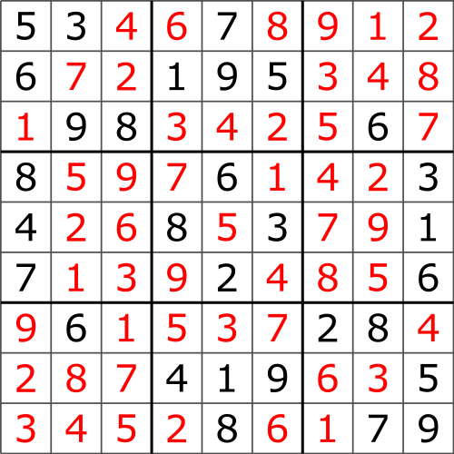
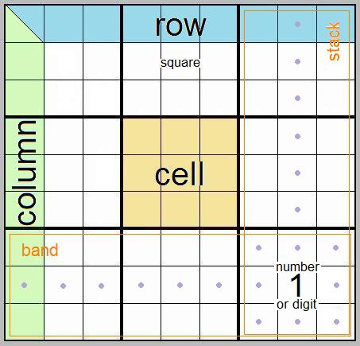

# Sudoku Checker

The purpose of this exercise is to code a simple sudoku resolver.

From Wikipedia:
> Sudoku (数独, sūdoku, digit-single) (/suːˈdoʊkuː, -ˈdɒk-, sə-/, originally called Number Place)[1] is a logic-based,[2][3] combinatorial[4] number-placement puzzle. In classic sudoku, the objective is to fill a 9×9 grid with digits so that each column, each row, and each of the nine 3×3 subgrids that compose the grid (also called "boxes", "blocks", or "regions") contain all of the digits from 1 to 9. The puzzle setter provides a partially completed grid, which for a well-posed puzzle has a single solution.

To take a quick overview, this is an unsolved Sudoku:

and it's solution:

## Rules

To solve a sudoku there are only three rules:

1. Not repeated numbers in each row
2. Not repeated numbers in each column
3. Not repeated numbers in each 3x3 cell.

## Files in this repository

In this repo you have some interesting resources:

* `data/right.csv` contains a CSV file with a right solved sudoku.
* `data/wrong.csv` contains a CSV file with a wrong solved sudoku.
* `app.php` it's an entrypoint to execute a sudoku validation. Feel free to change it as you need.
* `src/SudokuChecker.php` it's a class intended to be the sudoku checker. Feel free to change it as you need.

Feel free to install new third-party dependencies if you need it, except (obviously) for that ones which perform sudoku validations ;)

Happy coding!

## Explication of resolver

- `app.php` is the entrypoint.
    - Each time we refresh the page a new sodoku will be generate.
    - Here we generate the sudoku with SudokuGenerator.
    - Here we call SudokuChecker.

- `SudokuChecker` is the render point.
    - Here render the sudoku board un-resolved.
    - Try to resolve the sudoku with SudokuResolver.
    - If the sudoku have a solution render it.

- `SudokuGenerator` is the array sudoku generator
    - This is taken from other repository but adapted to these necesities.

- `SudokuResolver` this class was full resolved by my. Is all commented.
